<div align="center">

# Agent Plugins Marketplace

**Find open-source plugins for Codex, Claude Code, and Agent Plugins.**

Search public plugins, compare their supported formats, skills, and MCP servers, and review the source before installing.

[Browse the directory](https://pluginsmp.com) · [API & MCP docs](https://pluginsmp.com/docs) · [OpenAPI 3.1](https://pluginsmp.com/api/openapi.json) · [Full agent-readable catalog](https://pluginsmp.com/llms-full.txt)

[](https://github.com/IchenDEV/agent-plugin-mkt/actions/workflows/sync-github-plugins.yml)
[](https://pluginsmp.com)
[](LICENSE)

</div>


## What is this?

Agent Plugins Marketplace is a community index of open-source packages that follow one or more canonical plugin formats. It discovers repositories on GitHub, validates their manifests, merges cross-format variants into one entry, and exposes the result through a website, REST API, MCP server, and LLM-friendly text feeds.

It is an **index, not a package host**. Plugin code stays in its source repository, and the directory does not execute third-party plugins during indexing.

### One index, five surfaces

| Surface | Best for | URL |
|---|---|---|
| Web app | Browse, search, filter, and inspect plugins | [pluginsmp.com](https://pluginsmp.com) |
| REST API | Applications, scripts, and integrations | [`/api/v1/*`](https://pluginsmp.com/docs) |
| MCP | Native search from an agent session | [`POST /api/mcp`](https://pluginsmp.com/docs#mcp) |
| `llms.txt` | A concise guide for agents | [`/llms.txt`](https://pluginsmp.com/llms.txt) |
| `llms-full.txt` | Retrieval over the complete catalog | [`/llms-full.txt`](https://pluginsmp.com/llms-full.txt) |

All five surfaces read from the same validated snapshot.

## Try it

Search from a browser:

```text
https://pluginsmp.com/plugins?q=github
```

Search from code:

```bash
curl "https://pluginsmp.com/api/v1/plugins?q=github&protocol=codex&protocol=claude-code&sort=stars&per_page=10"
```

Connect an MCP client:

```json
{
  "mcpServers": {
    "agent-plugin-marketplace": {
      "type": "streamable-http",
      "url": "https://pluginsmp.com/api/mcp"
    }
  }
}
```

The MCP server is stateless and exposes three tools:

- `search_plugins` — search and filter the index
- `get_plugin` — retrieve a plugin, its manifests, skills, and MCP servers
- `get_stats` — retrieve current directory totals

## Plugin format compatibility

| Client | Plugin manifest | Catalog file |
|---|---|---|
| [Codex](https://developers.openai.com/plugins/build/plugins) | `.codex-plugin/plugin.json` | `.agents/plugins/marketplace.json` |
| [Claude Code](https://code.claude.com/docs/en/plugins-reference) | `.claude-plugin/plugin.json` | `.claude-plugin/marketplace.json` |
| [Agent Plugins v1](https://agent-plugins.org/specification) | `plugin.json` | — |

A repository may support one plugin format or several. When Codex and Claude Code manifests describe the same plugin root, the index stores one logical plugin with multiple `protocols` instead of duplicate listings.

Shared components are discovered from `skills/<name>/SKILL.md`. MCP configuration is read from canonical or manifest-referenced configuration files and normalized to `stdio`, `streamable-http`, or `sse` for filtering.

## How automatic discovery works

The index is refreshed by [GitHub Actions](.github/workflows/sync-github-plugins.yml) every day at **00:17 and 12:17 UTC**. It can also be started manually.

```mermaid
flowchart LR
    A["GitHub repository search"] --> B["Inspect candidate Git trees"]
    B --> C["Load canonical manifests"]
    C --> D["Validate skills and MCP config"]
    D --> E["Merge runtimes and upsert plugins"]
    E --> F["Validate SQLite snapshot"]
    F --> G["Commit snapshot to main"]
    G --> H["Vercel production deploy"]
    H --> I["Web · REST · MCP · llms.txt"]
```



Discovery combines repository metadata, topics, README signals, Git-tree inspection, and — when a dedicated token is configured — GitHub's legacy Code Search. It searches for all three supported manifest families instead of relying on a hand-maintained allowlist, so first-party and community repositories follow the same path.

Each sync:

1. Discovers candidate repositories across the supported protocols.
2. Inspects their trees for canonical manifests, including monorepos with multiple plugin roots.
3. Validates manifest fields, skills, and MCP server declarations.
4. Merges sibling runtime manifests and updates repository metadata and star counts.
5. Runs database integrity checks, protocol tests, and linting.
6. Commits a changed snapshot to `main`; Vercel deploys that snapshot automatically.

Unchanged repositories reuse their indexed components based on GitHub's `pushed_at` value. Sync is deliberately **upsert-only**: a plugin is not deleted merely because a bounded search fails to return it on a later run.

### Coverage boundaries

GitHub search is broad but not mathematically exhaustive. Individual search queries are capped at 1,000 results, API quotas apply, repositories can be private or temporarily unavailable, and some projects do not publish a canonical manifest. The workflow uses multiple protocol-specific windows and safely commits completed transactions when a run becomes quota-limited, but it does not claim to enumerate every repository on GitHub.

## REST API

The API is read-only, requires no authentication, and allows cross-origin requests.

| Endpoint | Description |
|---|---|
| `GET /api/v1/plugins` | Search and paginate plugins |
| `GET /api/v1/plugins/:slug` | Retrieve one plugin with manifests and components |
| `GET /api/v1/stats` | Retrieve live directory totals |
| `GET /api/v1/categories` | List manifest-keyword tags with counts |

Useful list parameters include `q`, `category`, `type`, `transport`, `sort`, `page`, and `per_page`. Repeat `protocol` to match any selected plugin format:

```text
/api/v1/plugins?protocol=codex&protocol=claude-code&type=mcp&sort=stars
```

See the [interactive documentation](https://pluginsmp.com/docs) for response shapes and examples, or consume the [OpenAPI schema](https://pluginsmp.com/api/openapi.json).

## Run locally

Requirements: Node.js 20.9+ and npm. The synchronization workflow currently runs on Node.js 24.

```bash
git clone https://github.com/IchenDEV/agent-plugin-mkt.git
cd agent-plugin-mkt
npm ci
cp .env.example .env
npx prisma db push
npm run db:seed
npm run dev
```

Open [http://localhost:3000](http://localhost:3000).

The default development database is SQLite at `prisma/dev.db`. Fonts are self-hosted through `@fontsource`, so the application does not fetch web fonts at build or runtime.

### Index public GitHub repositories

Authenticate with GitHub, then run the indexer:

```bash
GITHUB_TOKEN="$(gh auth token)" npm run index:github -- --max 40
```

Useful options:

| Option | Purpose |
|---|---|
| `--repository-max <n>` | Limit repository candidates |
| `--skip-code-search` | Use repository discovery and Git-tree validation only |
| `--allow-partial` | Keep completed transactions if an API quota is exhausted |

The indexer only talks to `api.github.com`, caps fetched file sizes, respects rate limits, and is idempotent.

To clear the local database before loading fixtures, run `npm run db:seed -- --reset`.

## Development commands

| Command | Purpose |
|---|---|
| `npm run dev` | Start the Next.js development server |
| `npm run build` | Create a production build |
| `npm test` | Run protocol and validation tests |
| `npm run lint` | Run ESLint |
| `npm run db:push` | Apply the Prisma schema |
| `npm run db:seed` | Load fixture plugins |
| `npm run db:validate` | Check SQLite integrity and report totals |
| `npm run index:github` | Discover and refresh public plugins |
| `npm run test:mcp` | Run the MCP protocol suite against a running server |

For MCP end-to-end tests:

```bash
npm run dev
BASE_URL=http://localhost:3000 npm run test:mcp
```

## Validation and trust model

Everything fetched from a plugin repository is treated as untrusted data.

- Manifests are parsed and validated according to their plugin format's rules.
- Invalid individual skills or MCP servers are isolated where the protocol permits it.
- Indexed descriptions and metadata are rendered as plain text.
- Only `http:` and `https:` URLs are linkified.
- Clipboard text is stripped of control characters.
- The directory links back to the source repository so users can inspect code and licensing before installation.

An index entry is evidence that a repository published a structurally valid manifest; it is **not** a security audit or endorsement of that plugin.

## Repository layout

```text
app/                  Next.js pages, REST routes, MCP, and text feeds
components/           Shared server and client UI components
lib/                  Queries, validation, GitHub discovery, and MCP logic
prisma/               Schema and deployable directory snapshot
scripts/              Indexing, seeding, validation, and MCP test tools
tests/                Protocol validation tests
fixtures/             Fictional local development plugins
.github/workflows/    Twice-daily synchronization
```

The visual language and component rules live in [DESIGN.md](DESIGN.md).

## Contributing

Bug reports, discovery gaps, protocol compatibility fixes, and focused pull requests are welcome. Before opening a change:

```bash
npm ci
npm test
npm run lint
npm run build
```

If a public plugin is missing, first confirm that its repository contains a canonical manifest listed under [Plugin format compatibility](#plugin-format-compatibility). Include the repository URL and manifest path in the issue so the discovery gap can be reproduced.

## License

Released under the [MIT License](LICENSE). Indexed plugins retain their own licenses and remain the responsibility of their respective authors.
